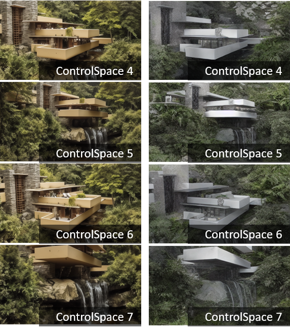

# ControlSpace
**
News**: Demo： <a href = "https://labs.jianchuang.tech">简创实验室</a> ( for Chinese users ) . Although the interface is not currently open, it will be online as soon as possible

**News:**
For a full introduction, please visit <a href = 'https://mp.weixin.qq.com/s/Mvjj-VETki8ol5yTEkqa3A' >发布 | ControlSpace空间多视角一致性图像生成框架，刷新AIGC设计应用SOTA</a>.

**Note: Please don't forget to give us a star if you like this project. Thanks!** :stuck_out_tongue_winking_eye:

---

[//]: # (~~**A demo that can be experienced is being prepared.**~~)

**ControlSpace: Multi-view consistent image generation framework, updated the AIGC design application SOTA**

Institute for AID Lab

 

# Demo

    
    
    

    
    

  <!-- 插入一行间距 -->

    

  <!-- 插入一行间距 -->

  
    
    

# Method

The framework consists of two main components: Geometric Consistency and Style Consistency.

  <!-- 插入一行间距 -->

**Geometric Consistency**

The geometric consistency part involves techniques such as iterative alignment strategies and alignment-aware training strategies to establish geometric priors on Nerf/Mip-Nerf models (AGP).

**Style Consistency**

The style consistency component employs cross-frame non-local attention modules to address frame alignment issues.

# Performance Evaluation

The Control Space framework demonstrates a significant advantage in terms of consistency when compared to generating multiple images through ControlNet individually.

# Future Developments

Our future work aims to enhance the controllability of 3D scenes based on the Control Space framework.

    
    

    
    

    
    

# Contact Us

Email: business@aidlab.tech

    

